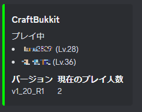

# MCDiscordNotifier
Minecraftサーバーへのプレイヤーの入退室ログやサーバーの状態をDiscordのテキストチャンネルに投稿するSpigotプラグインです。

## 概要
このプラグインでは、Discordのチャンネルは2つ使用します。
Discordで、Minecraftのロギング用チャンネルとサーバーの状態を表示・更新するステータス表示用チャンネルの2つのチャンネルを用意してください。

## 機能
- Minecraftサーバーの起動有無
- Minecraftサーバーの入退室ログ





## 実装予定
- 言語切り替え(現行のままでも```config.yml```の```message```を書き換えれば可能です。)
- ゲーム内アクティビティ(実績解除等)のロギング機能
- DiscordとMinecraft内のチャットの連携
- その他コマンド等の機能強化

## インストール方法
1. サーバープラグインの```jar```ファイルをSpigotサーバーの```plugins```ディレクトリに設置してください。
2. ```plugins```ディレクトリに、```MCDiscordNotifier```ディレクトリを作成し、その中に```config.yml```を作成してください。
3. ```config.yml```に以下の内容を記述してください。(DiscordのBotトークンとチャンネルIDを書き換えて下さい。)
```yml
DISCORD:
  TOKEN: "YOUR_DISCORD_BOT_TOKEN"
  CHANNEL:
    SERVER_STATUS: "YOUR_DISCORD_CHANNEL_1"
    SERVER_LOG: "YOUR_DISCORD_CHANNEL_2"

message:
  none_player: "現在プレイヤーはいません。"
  disable_server: "サーバーは停止中です。"
  on_plugin_enable: "プラグインが起動しました。"
  on_plugin_disable: "プラグインが停止しました。"
  on_server_enable: "サーバーが起動しました。"
  on_server_disable: "サーバーが停止しました。"
  on_player_join: "%sさんがサーバーに入室しました。"
  on_player_quit: "%sさんがサーバーを退出しました。"
  on_discord_ready: "Discordに接続しました。 [%s]"

string:
  server_name: "Hal mates Server"
  on_player_join: "サーバー入室"
  on_player_quit: "サーバー退室"
  player_name: "プレイヤー名"
  player_lv: "レベル"
  on_play: "プレイ中"
  max_players: "最大プレイ人数"
  online_players: "現在のプレイ人数"
  version: "バージョン"

value:
  server_status_message_id: ""
```

## 作者
フォローしてくだちぃ
- [Twitter : @T00156](https://twitter.com/T00156) 
- [GitHub : nagahisa-takafumi](https://github.com/nagahisa-takafumi)

# License
The source code is licensed MIT. The website content is licensed CC BY 4.0,see LICENSE.
